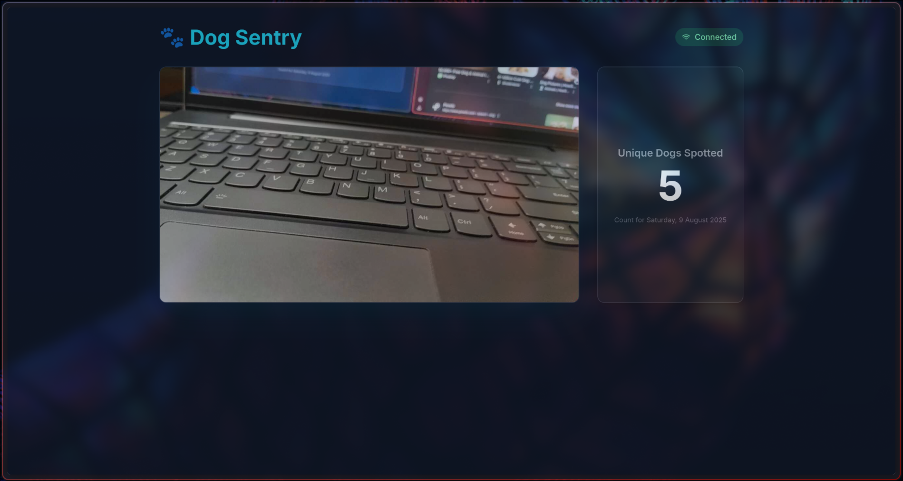
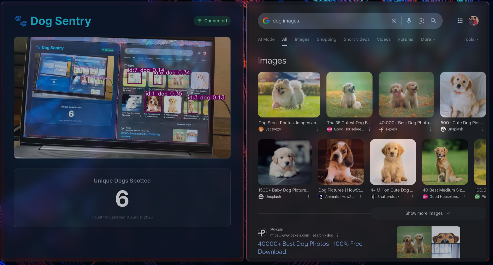

# Dog Sentry 🎯

## Basic Details
### Team Name: Dog Sentry

### Team Members
- Team Lead: George Sandeep, *College of Engineering, Trivandrum*

### Project Description
Basically, what it does keep a real-time count of dogs who appear within the camera's scope for a fixed period of time.

### The Problem (that doesn't exist)
Ever wondered how many dogs are around you? These little puppers are everywhere, but then, you never know just how many surround you, even if you see them. This project aims to solve this very issue, and keep track of how many are around you. 

### The Solution (that nobody asked for)
I intend to solve it by using all the trash cameras around you, which are meant to keep an eye out for robberies but mysteriously turn off or fetch corrupted AV data whenever it's intention was to be fulfilled. Basically, giving the unemployed a job. 
This software keeps a count of how many "unique" dogs surround a camera for a given period of time, and the program has been done with ADB using a mobile-camera for proof-of-concept. But still, it can be deployed for such uses later on, wirelessly.

## Technical Details
### Technologies/Components Used
For Software:
- Python, JS
- React, Tailwind CSS
- PyTorch, OpenCV, FastAPI, TorchVision, Ultralytics-YOLOv8
- Python Venv, Uvicorn, NumPy, SciPy, IP WebCam App

For Hardware:
- A mobile camera
- Any mobile with a working camera and runs Android 6+
- A USB cable?! I mean, it was only for proof-of-concept..

### Implementation
For Software:
- fastapi
- uvicorn[standard]
- python-socketio
- opencv-python-headless
- torch
- torchvision
- ultralytics
- numpy
- scipy

# Installation
npm install so

# Run
uvicorn main:app
adb forward tcp:8080 tcp:8080
npm start

### Project Documentation
To run the full application, you need to start three processes in order, each in its own terminal window.

1. Start the ADB Bridge:
Connect your phone (with USB Debugging enabled and the "IP Webcam" app running) and run:
adb forward tcp:8080 tcp:8080

2. Start the Python Backend Server:
In the directory with your main.py file, run:
uvicorn main:app --reload

3. Start the React Frontend App:
In your React project directory, run:
npm start

# Screenshots (Add at least 3)

ADB successfully connected to Phone.

AI model recognizes the images of a dog.

Since this project uses off-the-shelf hardware (a computer and a smartphone), there are no custom electronic schematics or circuit diagrams involved. The primary "circuit" is the data connection established by the USB cable.

Connection diagram showing the smartphone connected to the host computer via a USB-C data cable. The computer runs the backend processing, and the phone provides the video source.

### Project Demo
# Video
[Shows how the project works](https://drive.google.com/file/d/1PaPvZgMvNVAAUU6Tt3-pn5ReZ2oI_tJD/view?usp=drive_link)
The video demonstrates the working of the project, from its initialization to identifying images of dogs shown.

---
Made with ❤️ at TinkerHub Useless Projects 

